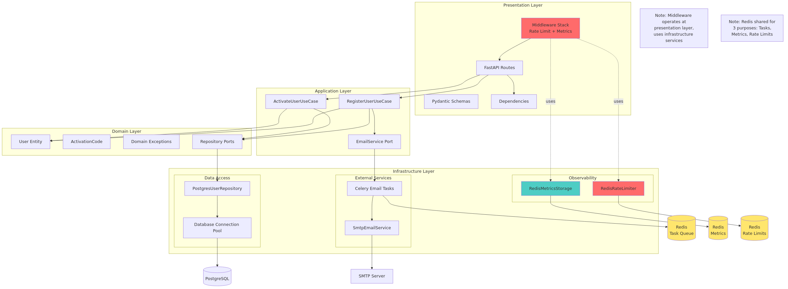
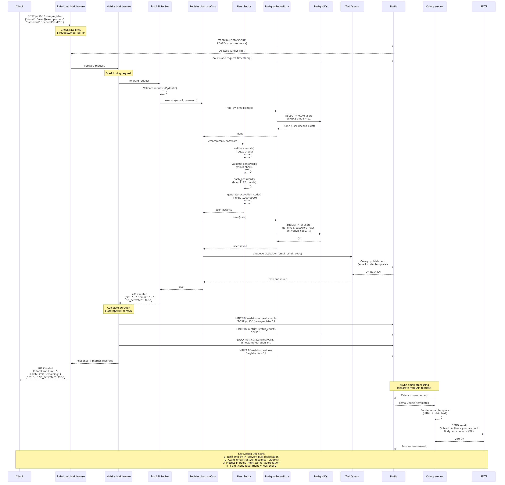
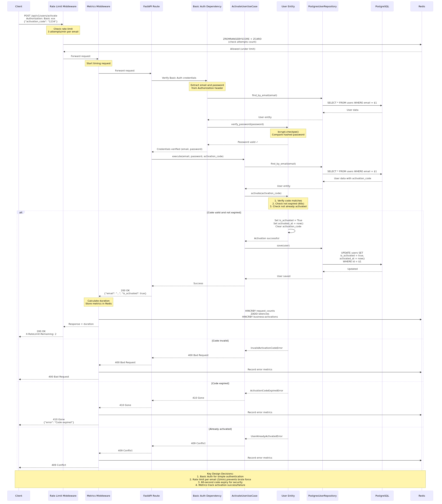
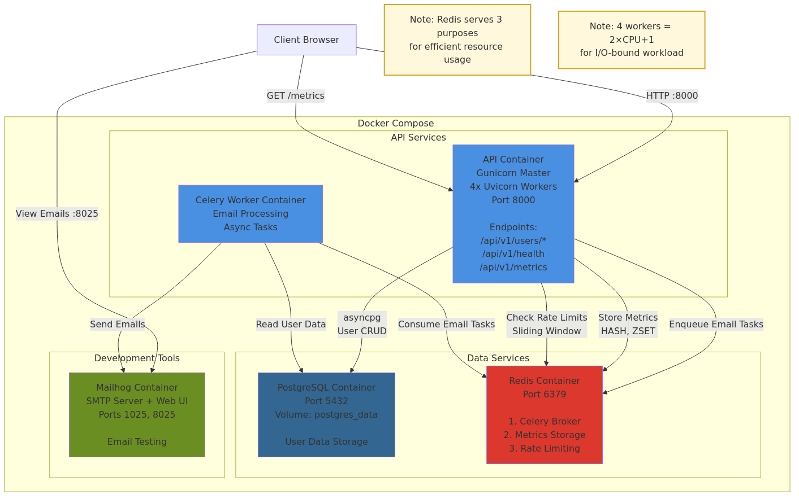
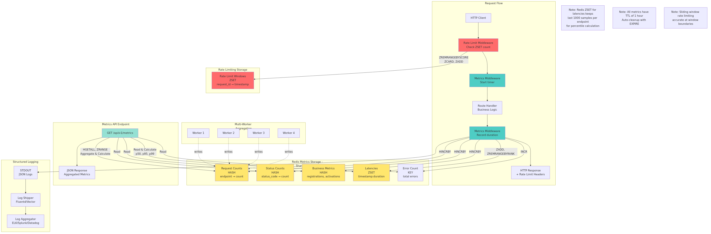
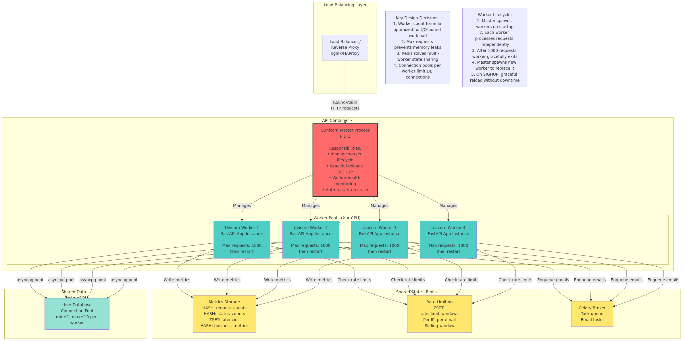

# Architecture

## Overview

This API implements **Clean Architecture** (also known as Hexagonal Architecture), providing clear separation of concerns and making the system testable, maintainable, and scalable.

## Clean Architecture Diagram



This diagram shows the four-layer Clean Architecture implementation with clear separation of concerns.

## User Registration Flow (Sequence Diagram)



This diagram shows the complete request flow through all layers when a user registers, including:

- **Rate limiting middleware** checking IP-based limits (5/hour)
- **Metrics middleware** recording latencies and business metrics
- **Async email processing** via Celery with Redis storage

## User Activation Flow (Sequence Diagram)



This diagram shows the activation flow with:

- **Basic Auth verification** for user authentication
- **Rate limiting per email** (3 attempts/minute) to prevent brute force
- **Activation code validation** with 60-second expiry check
- **Metrics recording** for activation success/failure tracking

## Container Deployment Architecture



This diagram shows how the application runs in Docker containers with:

- **Multi-worker API:** Gunicorn master + 4 Uvicorn workers for parallel request handling
- **Redis triple-duty:** Celery broker, metrics storage, rate limiting state
- **Stateless design:** Can run multiple API containers behind a load balancer
- **Independent scaling:** Workers scale separately from API based on queue depth
- **Data persistence:** PostgreSQL volume survives container restarts

## Observability Architecture



This diagram illustrates the observability system:

- **Request flow:** Rate Limit → Metrics → Handler → Response
- **Redis storage:** HASH for counters, ZSET for latency percentiles
- **Multi-worker aggregation:** All workers write to shared Redis
- **Metrics API:** GET /api/v1/metrics returns aggregated data
- **Structured logging:** JSON logs to STDOUT for log aggregators

## Multi-Worker Architecture



This diagram shows Gunicorn's worker management:

- **Master process:** Manages worker lifecycle, graceful reloads, health monitoring
- **Worker count:** (2 × CPU cores) + 1 = 4 workers for I/O-bound workload
- **Shared state:** Redis provides distributed metrics and rate limiting
- **Connection pooling:** Each worker maintains its own PostgreSQL connection pool
- **Memory safety:** Workers restart after 1000 requests to prevent memory leaks

## Layer Responsibilities

### 1. Domain Layer (`src/domain/`)

**Core business logic and entities - framework independent.**

- `user.py`: User aggregate with business rules (password validation, activation logic)
- `activation_code.py`: Activation code value object with expiration logic
- `exceptions.py`: Domain-specific exceptions (UserAlreadyExistsError, WeakPasswordError, etc.)
- `user_repository.py`: Repository interface defining contract for user persistence

**Key principle:** Domain knows nothing about FastAPI, PostgreSQL, or Celery. Pure Python business logic.

### 2. Application Layer (`src/application/`)

**Use cases orchestrating business workflows.**

- `register_user.py`: Orchestrates user registration (validate → create user → generate code → enqueue email)
- `activate_user.py`: Orchestrates activation (verify credentials → validate code → activate user)
- `email_service.py`: Email service interface abstraction

**Dependency injection:** Use cases depend on port interfaces, not concrete implementations.

```python
class RegisterUserUseCase:
    def __init__(
        self,
        user_repository: UserRepository,  # Interface
        task_queue: TaskQueue,  # Interface
    ):
        # Use cases don't know if it's PostgreSQL, MongoDB, or in-memory
```

### 3. Infrastructure Layer (`src/infrastructure/`)

**Adapters implementing the ports - framework specific.**

- `database/`: PostgreSQL implementation of UserRepository
  - `connection.py`: Connection pool management
  - `postgres_user_repository.py`: PostgreSQL adapter for user persistence
- `email/`: SMTP email service implementation
  - `smtp_email_service.py`: SMTP adapter for email delivery
- `tasks/`: Celery task queue implementation
  - `celery_config.py`: Celery configuration
  - `email/tasks.py`: Email sending tasks
- `observability/`: Metrics and monitoring infrastructure
  - `metrics_middleware.py`: Request metrics collection middleware
  - `redis_metrics_storage.py`: Redis-backed distributed metrics storage
  - `logger.py`: Structured JSON logging configuration
- `rate_limiting/`: Request rate limiting infrastructure
  - `redis_rate_limiter.py`: Redis-backed sliding window rate limiter
  - `dependencies.py`: FastAPI rate limit dependency injectors

**Interchangeable:** Can swap PostgreSQL for MongoDB by implementing UserRepository interface.

### 4. Presentation Layer (`src/presentation/`)

**HTTP API exposing the system.**

- `routes.py`: FastAPI endpoints (thin controllers)
- `schemas.py`: Request/response DTOs (Pydantic models)
- `dependencies.py`: Dependency injection setup

**Single responsibility:** Convert HTTP requests to use case calls, convert domain exceptions to HTTP status codes.

## Key Design Decisions

### 1. Stateless API

**Every request is independent - no session data stored in API instances.**

Benefits:

- Easy horizontal scaling (add more containers)
- Zero-downtime deployments
- Load balancing friendly

### 2. Async Task Processing

**Email sending happens in background via Celery + Redis.**

```
Synchronous approach:
User → API → [Wait 2-5s for email] → Response

Asynchronous approach:
User → API → Response (200ms)
         ↓
    Celery Worker → Email
```

This keeps API response times fast (<200ms) while ensuring reliable email delivery.

Using Tasks also allow us replaying failed tasks if needed and ensure better observability.

### 3. Database Connection Pooling

**Reuse connections instead of creating new ones.**

Using asyncpg connection pooling reduces database latency and improves throughput.

### 4. Redis for Cross-Worker State

**Multi-worker deployments require shared state - Redis provides distributed storage.**

With Gunicorn running 4 Uvicorn workers, each worker is an independent process. Redis acts as shared state for:

```
Worker 1 →┐
Worker 2 →├→ Redis → Aggregated metrics, rate limits, task queue
Worker 3 →┤
Worker 4 →┘
```

**Benefits:**

- Accurate metrics across all workers
- Consistent rate limiting regardless of which worker handles the request
- Already required for Celery, so no additional infrastructure

**Key usage:**

- `HASH` data structure for counters (requests, status codes)
- `ZSET` data structure for sliding windows (latencies, rate limits)

### 5. Observability via Lightweight Middleware

**Custom middleware for metrics instead of heavyweight APM.**

**Choice:** Lightweight custom middleware writing to Redis + structured logs to STDOUT

**Why:**

- **Simplicity:** No external agents (Datadog, New Relic) or complex instrumentation
- **12-Factor App compliance:** Logs as event streams, externalize to aggregators
- **Cost:** No SaaS fees for small deployments
- **Flexibility:** Easy to migrate to Prometheus, OpenTelemetry, or APM later

**What's tracked:**

- Request counts per endpoint
- Status code distributions
- Latency percentiles (p50, p95, p99)
- Business metrics (registrations, activations)

**Production integration:**

- Middleware can export to Prometheus `/metrics` endpoint or push to Datadog/New Relic with minimal code changes.
- Redirect to whatever service (datadog, grafana ...) instead of using stdout.

## Technology Choices

### FastAPI

- **Why:** Modern async framework, automatic OpenAPI docs, Pydantic validation
- **Alternatives:** Flask (sync), Django (heavier)

### PostgreSQL

- **Why:** ACID guarantees, mature ecosystem, required (no SQLite per specs)
- **Raw SQL:** No ORM per requirements

### Celery + Redis

- **Why:** Industry standard for async tasks, robust retry logic
- **Pattern:** Treats email as third-party service (per requirements)

### Redis (Triple-Duty)

- **Why:** Single infrastructure component serving three critical functions
- **Uses:**
  1. **Celery broker:** Task queue for async email sending
  2. **Metrics storage:** Distributed counters and latency tracking (HASH + ZSET)
  3. **Rate limiting:** Sliding window state across workers (ZSET)
- **Benefits:** Reduces infrastructure complexity, already required for Celery
- **Data structures:**
  - `HASH`: O(1) counter increments (request counts, status codes)
  - `ZSET`: O(log N) sorted sets for time-based data (latencies, rate limit windows)

### Docker

- **Why:** Ensures consistent environments

### Ruff

- **Why:** Fast all-in-one linter/formatter (10-100x faster than black+flake8)

## Testing Strategy

```
tests/
├── unit/               # Fast, isolated tests
│   ├── test_user.py           # Domain entities
│   ├── test_activation_code.py
│   └── test_use_cases.py      # Use cases with mocks
├── integration/        # Tests with real database, mocked Celery
│   ├── test_user_registration.py
│   └── test_user_activation.py
└── e2e/               # Full system tests with real Celery
    └── features/      # BDD scenarios
        └── user_registration_e2e.feature
```

**Coverage:** Extensive coverage across all layers

**Strategy:**

- **Unit tests:** Fast feedback on business logic
- **Integration tests:** Verify API contracts with mocked async tasks
- **E2E tests:** Validate complete flows with real Celery + Mailhog

## Security Considerations

1. **Password hashing:** bcrypt with salt (industry standard)
2. **Activation code expiration:** 60 seconds (prevents brute force)
3. **HTTP Basic Auth:** Simple authentication for activation endpoint
4. **Rate limiting:** Prevents abuse and brute force attacks
   - Registration: 5 requests/hour per IP (prevents bulk account creation)
   - Activation: 3 requests/minute per email (prevents code brute forcing)
   - Sliding window algorithm (accurate at boundaries, no burst allowance)
5. **Input validation:** Pydantic schemas validate all requests
6. **SQL injection prevention:** Parameterized queries (asyncpg)
7. **Pre-commit hooks:** detect-secrets, bandit for security scanning
